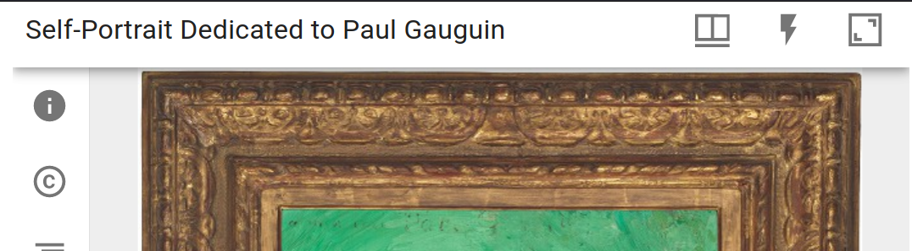
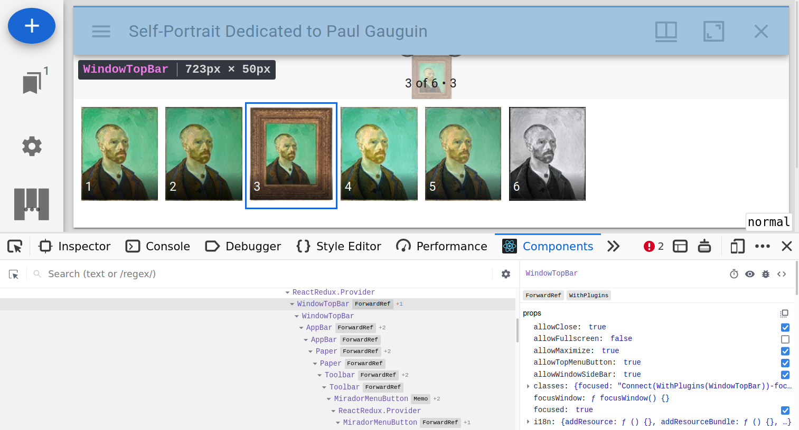
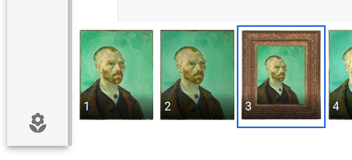

## Prerequisites

Before you start developing your own Mirador 3 plugin, you should be familiar with a few technologies
that are essential for Mirador 3 plugin development:

- **Familarity with a JavaScript build tool**: This can be something like Webpack, Parcel, Snowpack, etc,
  as long as it supports loading ES6 modules. This is needed, since Mirador 3 plugins cannot be loaded
  from a `<script>` tag at the moment, but have to be part of the same bundle as Mirador 3. If you don't
  have a favorite tool yet, [Parcel](https://v2.parceljs.org/) is very easy to use.
- **React**: This should be obvious, Mirador 3 is a React app and plugin development is based on adding
  custom React components to the app. Essential resources are the [React Tutorial][react-tutorial] and
  the section on [Higher Order Components][react-hoc]
- **Redux and React-Redux**: The global state in Mirador 3 is completely handled by the Redux library. Plugins
  that want to access or mutate the app state, or need their own global state, must make use of it.
  Essential resources are the [Redux Essentials][redux-essentials] and the [Redux Fundamentals][redux-fundamentals].
  It's also a good idea to read through the [Selector Intro][redux-reselect] for an introduction to
  selector functions, which are heavily used in M3.
- **Redux-Saga**: Side-effects in Mirador 3 are handled with this library. It's also a highly useful tool
  for *reacting to Redux actions*, which can come in extremely handy when developing plugins (e.g. if you want
  your plugin to react to a page change). Essential resources are the [Redux-Saga Introduction][saga-intro]
  and [Redux-Saga Basic Concepts][saga-basic-concepts].

You can learn all of those technologies "as you go", but I recommend to work at least through the basic
introductions beforehand.

[react-tutorial]: https://reactjs.org/tutorial/tutorial.html
[react-hoc]: https://reactjs.org/docs/higher-order-components.html
[redux-essentials]: https://redux.js.org/tutorials/essentials/part-1-overview-concepts
[redux-fundamentals]: https://redux.js.org/tutorials/fundamentals/part-1-overview
[redux-reselect]: https://redux.js.org/recipes/computing-derived-data
[saga-intro]: https://redux-saga.js.org/docs/introduction/GettingStarted
[saga-basic-concepts]: https://redux-saga.js.org/docs/basics/DeclarativeEffects

## Mirador 3 Architecture: Containers and Components
Many components in Mirador 3 are split into two separate parts: a **Container** and a **Component**.

The **Component** is simply a React component that takes props and renders something, it does not
know about things like Redux, the plugin system or the internationalization system. It is solely
concerned with displaying the UI to the user, based on data received via props, and receiving user
input and forwarding it up the component tree via callbacks that were provided in the props.

The **Container** then takes care of hooking up the component to the aforementioned systems.
It's implemented as a *Higher Order Component* that wraps the component and supplies the connections
to these systems via props, i.e. it receives data from the Redux store and provides it as props to
the Component, and it wraps Redux action creators in functions that are also passed as props.

This is a well-established pattern in React apps, you can read more about it in this article:
[Container Components][container-components].

[container-components]: https://medium.com/@learnreact/container-components-c0e67432e005

## What's in a Mirador 3 plugin

A Mirador 3 plugin is a **React Component** that *targets* plugin-aware React Components within Mirador.
Such a plugin component can attach itself to a plugin-aware Mirador 3 component in two distinct ways:

- `add`: The target component includes a slot where the plugin component will be added as part of the
         target components' virtual DOM tree. This is used to extend existing components with new
         widgets, e.g. a button in the window title bar or a new entry in the ribbon menu.
- `wrap`: The plugin components **wraps** the target component and (optionally!) renders the target
          component as a child of its own virtual DOM tree. This allows the complete substitution of
          every plugin-aware React Component inside of Mirador 3. The wrapped component can be accessed
          via the `TargetComponent` prop that gets passed to the wrapping plugin component, this can
          be used to render it in the plugin's JSX via. `<props.TargetComponent ...props>`. This is useful
          if you want to e.g. add the option to toggle the visibility of a given component or you want to
          wrap the existing component with custom markup.

To define a plugin, create a JavaScript object with the following keys:

```js
{
    // The plugin component that should be added
    component: MyPluginComponent,
    // The name of the plugin-aware Mirador 3 component that this plugin targets
    target: 'SomeMiradorComponent',
    // Can be 'add' or 'wrap', defines how the plugin component is rendered
    mode: 'add',
    // Refer to the Redux documentation for these two functions. The props that are
    // passed are those of the target component
    mapDispatchToProps: (dispatch, props) => { /* ... */ },
    mapStateToProps: (state, props) => { /* ... */ },
    // Define new sub-stores along with their respective reducers
    reducers: { /* ... */ },
    // Define a custom saga that should be run as part of the Mirador 3 root saga
    saga: myCustomSaga,
}
```

Then, to tell Mirador 3 to load the plugin, pass an array of all plugin definitions as the
second argument to the `Mirador.viewer` initialization function:

```js
// This assumes that the above plugin definition is exported from a `myPlugin.js` file in the
// same directory.
import myPluginDefinition from './myPlugin';

const myMiradorInstance = Mirador.viewer({ /* mirador config ... */ }, [myPluginDefinition]);
```

## Locating plugin-aware Mirador 3 components
To check if a given component supports `add` plugins, search for uses of the `PluginHook` component
inside of `src/components` modules in the Mirador 3 source code (or use this [GitHub Link][gh-pluginhook-search]).
The position of the `<PluginHook />` definition will be the position where the plugin component is rendered.

For components that support `wrap` plugins, search for uses of the `withPlugins` HOC inside of the
`src/containers` modules, (or use this [GitHub Link][gh-withplugins-search]). All of the container
components that are wrapped with this HOC can be `wrap`ped by a plugin component.

[gh-pluginhook-search]: https://github.com/search?q=PluginHook+repo%3AProjectMirador%2Fmirador+extension%3Ajs+path%3Asrc%2Fcomponents&type=Code&ref=advsearch&l=&l=
[gh-withplugins-search]: https://github.com/search?q=withPlugins+repo%3AProjectMirador%2Fmirador+extension%3Ajs+path%3Asrc%2Fcontainers&type=Code&ref=advsearch&l=&l=

## Accessing the Mirador 3 app state with Redux Selectors
If you want to get access to the current application state, e.g. to tell what the currently displayed
manifest is, you will have to access Mirador 3's global application state, which is implemented as a
Redux store. You cannot access it directly, but will instead have to supply a `mapStateToProps` object
in your plugin definition that maps your plugin component's props to a **selector function** that pulls
a value from the Redux store and passes it as a prop.

The tl;dr of a selector function is that it's a function that thakes the **Redux State** and optionally
some  other selectors (dependencies) and extracts and returns some data from that. Think of them like a
stored procedure in a DBMS, targetting your Redux state.

Mirador 3 ships with a ton of selector functions that should satisfy most of your needs as a plugin author,
you can find them in the [`src/state/selectors`][src-selectors] directory. Unfortunately they're barely
documented at the moment, but grepping for them in the code base and unit tests should give you a good idea
of how to use them. Maybe you can even take the time to make a documentation PR when you've understood a
selector? :-)

To illustrate, here's a small plugin definition that receives the identifier of the manifest that is currently
rendered in its associated compnion window. It targets the `OpenSeadragonViewer` component, which receives a prop
`windowId` that has the identifier of the window that renders the current instance of the component.
With this, we can use the `getWindow` selector to get the state of the current window, which has a property
`manifestId` with the manifest that is displayed.

```js
//
import { getWindow } from 'mirador/selectors';

const myPlugin = {
  component: MyPluginComponent,
  target: 'OpenSeadragonViewer',
  mode: 'add',
  // The function receives the Redux state and the target component's props
  mapStateToProps: (state, { windowId }) => ({
    // The plugin component will receive a `manifestId` prop with the identifier
    // of the window's current manifest
    manifestId: getWindow(state, { windowId }).manifestId,
  })
}
```

The hard part of the above is finding out which part of the Redux state you actually need and which of the
pre-existing selectors you can use to get that. For the former, it's a good idea to have the
[Redux DevTools][redux-devtools] installed, they allow you to browse through the Redux state and check
where the information you need is located. From there, you can browse through the
[available selectors][src-selectors] and check if there is one that extracts it already. Generally the
selector modules are structured like this:

- Selectors for a few common top level sub-stores are located in the [`getters`][src-getters] module
- Selectors for specific sub-stores and their children are usually in a module that's named after
  the sub-store, e.g. the `companionWindows` sub-store has a [`companionWindows.js`][src-companion]
  selector module that has selector functions to access its values

[redux-devtools]: https://github.com/reduxjs/redux-devtools
[src-selectors]: https://github.com/ProjectMirador/mirador/blob/master/src/state/selectors
[src-getters]: https://github.com/ProjectMirador/mirador/blob/master/src/state/selectors/getters.js
[src-companion]: https://github.com/ProjectMirador/mirador/blob/master/src/state/selectors/companionWindows.js


## Mutating Mirador 3 state with Redux Actions

If you want to trigger some change in the application, you have to change the corresponding value
in the Redux store. As usual, this cannot be done directly, but only through **actions** that are
triggered by **action creator functions**. Much like selectors, Mirador ships with creator functions
for every possible action, and we can use them in our plugins.

To use action creator functions from Mirador 3, map them to your plugin component's props with the
`mapDispatchToProps` field in the plugin definition. As an example, here's a custom pagination plugin
that uses the [`setNextCanvas` and `setPreviousCanvas` action creator functions][canvas-fns] to page
through a manifest's canvases (maybe the plugin adds a slideshow mode?)

```js
import { setNextCanvas, setPreviousCanvas } from 'mirador/actions';

const myPlugin = {
  component: MyPluginComponent,
  target: 'OpenSeadragonViewer',
  mode: 'add',
  // The function receives the dispatch function and the target component's props
  mapDispatchToProps: (dispatch, { windowId }) => ({
    // The props are functions that create the action with the action creator function and
    // dispatch it to the Redux middleware, i.e. you can ju st call props.setNextCanvas()
    // in the component
    setNextCanvas: () => dispatch(setNextCanvas(windowId)),
    setPreviousCanvas: () => dispatch(setPreviousCanvas(windowId)),
  })
}
```

[canvas-fns]: https://github.com/ProjectMirador/mirador/blob/5ca33205bf9bac636ba5ef0faf820f58c0d9751d/src/state/actions/canvas.js#L35-L54


## Reacting to Mirador 3 Redux Actions with a custom plugin Saga

Adding custom elements to the viewer, reading and changing the current state already offers a lot of options for implementing custom
behaviors in Mirador 3. But the real power of the plugin system comes from the ability to react to Redux actions dispatched inside of
Mirador with a custom Redux-Saga state machine. If you haven't yet read through the Redux-Saga documentation, I recommend doing so
before tackling this section.

The entry point for defining a custom saga for a plugin is the `saga` key in your plugin definition. The value of this key is a
saga *generator function* that returns *side effects* that map Redux actions to other functions (generator or just regular ones).
These are called whenever the associated action is dispatched.

As a simple example, this plugin prints the current canvas identifier whenever the canvas in a window changes:

```javascript
import { takeEvery } from 'redux-saga/effects';

/** This will be called every time the SET_CANVAS action is dispatched */
const onCanvasChange = function* (action) {
  console.log(action.payload.canvasId);
}

const pluginSaga = function* () {
  /* `takeEvery` calls the associated function every time the action is dispatched */
  yield takeEvery('SET_CANVAS', onCanvasChange);
}

const myPlugin = {
  component: () => null,
  saga: pluginSaga,
}
```

Note that in `onCanvasChange` you could just as well wait for other actions (`take`, `takeEvery`, `takeLeading`, etc), query the application state (`select`) or dispatch actions of your own (`put`). This allows you to build complex state machines that react to events within the Mirador and
interact with its state.

However, great power comes with great responsibility: It's really easy to shoot yourself in the foot here, e.g. by accidentally creating an infinite
loop. It's also coupled incredibly tightly to internal details of the Mirador implementation, so thoroughly test your plugin with every new Mirador
version to catch breakages early. Debugging Sagas is kind of painful due to the asynchronous nature of the state machines, so it's best to tread
carefully and not overload the plugin sagas too much.


## Styling plugin components

TODO

## Internationalization with react-i18next

TODO

## Example I: Stateless `add` plugin

This is a minimal plugin that simply adds a small button to the window bar that simply prints
`Hello World from the window title bar!` to the console.



**Step 1: Locating the target component**

First, we need to find out which component we should target for rendering the button. For this,
it's very useful to run Mirador 3 locally (i.e. without source minification) and use the React
developer tools in the browser to find the corresponding React component.



The component tree tells us that the component that renders the window title bar that we want
to add our button to is the `WindowTopBar`. But does it have a `<PluginHook />` for rendering
`add` plugins? Grepping for it doesn't yield anything, but there are two other nodes in the
virtual DOM that relate to plugins: `<WindowTopBarPluginArea />` and `<WindowTopBarPluginMenu />`!
The latter renders its children as a drop-down menu that is accessible via a "ribbon menu", while
the former directly adds its children to the window top bar, just what we need!

**Step 2: Writing the plugin component**
Looking at the source code of the `WindowTopBar` component, we can see that the buttons that
are already present in the top bar all make use of the `MiradorMenuButton` component to render.
So it's probably a good idea to use it in our plugin as well! It has just a few simple props,
of which we are only going to use `onClick` and the support for child elements:

```jsx
// This should be in a `MyPlugin.jsx` file
// Mirador 3 uses the `material-ui` React UI framework, so we can use it as a source for icons
import FlashOnIcon from '@material-ui/icons/FlashOn';

export default () => (
    <MiradorMenuButton
        onClick={() => console.log('Hello World from the window title bar!')}
    >
        <FlashOnIcon />
    </MiradorMenuButton>
);
```

**Step 3: Defining and registering the plugin**

Now that we know our target component (`WindowTopBarPluginArea`) and we have our plugin
component in `MyPlugin.jsx`, all that's left is to write a small plugin definition and
tell Mirador 3 to load it!

```js
import MyPlugin from './MyPlugin';

const myPlugin = {
    component: MyPlugin,
    target: 'WindowTopBarPluginArea',
    mode: 'add'
}

const mirador = Mirador.viewer({ /* cfg goes here */ }, [myPlugin]);
```

## Example II: Stateless `wrap` plugin that replaces a default component
For this example, we'll replace Mirador's default branding with our own, a small flower icon:



The basic approach is the same as for the `add` case:

1. Digging around in the component tree shows that we need to replace the `Branding` component
2. For our custom branding, we use the original component as a blueprint and simply replace the icon:
   ```jsx
   // MyBranding.jsx
   import React from 'react';
   import IconButton from '@material-ui/core/IconButton';
   import Typography from '@material-ui/core/Typography';
   import LocalFloristIcon from '@material-ui/icons/LocalFlorist';

   // The wrapping plugin components gets the same props as the component to be wrapped
   export default function MyBranding({ variant, ...ContainerProps }) {
     return (
       <div {...ContainerProps}>
         { variant === 'wide' && (
         <div>
           <Typography align="center" component="p" variant="h3">{t('mirador')}</Typography>
         </div>
         )}
         <Typography align="center">
           <IconButton
             component="a"
             href="https://example.com"
             target="_blank"
             rel="noopener"
           >
               <LocalFloristIcon />
           </IconButton>
         </Typography>
       </div>
     );
   }
   ```
3. For registering the plugin, we only need to swap out the components and the mode:
   ```js
   import Mirador from 'mirador'
   import MyBranding from './MyBranding'

   const myPlugin = {
       component: MyBranding,
       target: 'Branding',
       mode: 'wrap'
   };
   const mirador = Mirador.viewer({ /* cfg goes here */ }, [myPlugin]);
   ```

**If you want to render the wrapped component as part of your plugin component's tree**,
you can access it via the `TargetComponent` prop, i.e. use `<props.TargetComponent ...props>`
to render it in JSX. This can be useful if you want to e.g. add the option to toggle the
visibility of a given component or you want to customize the look of a component in a way
that requires changes to the markup.


## Example III: Plugin that interacts with the app state

TODO

## Example IV: Plugin that reacts to Redux actions with a saga

TODO