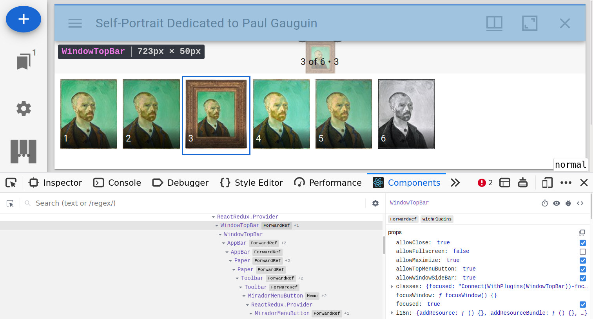

## Prerequisites

Before you start developing your own Mirador 3 plugin, you should be familiar with a few technologies
that are essential for Mirador 3 plugin development:

- **Familarity with a JavaScript build tool**: This can be something like Webpack, Parcel, Snowpack, etc,
  as long as it supports loading ES6 modules. This is needed, since Mirador 3 plugins cannot be loaded
  from a `<script>` tag at the moment, but have to be part of the same bundle as Mirador 3. If you don't
  have a favorite tool yet, [Parcel](https://v2.parceljs.org/) is very easy to use.
- **React**: This should be obvious, Mirador 3 is a React app and plugin development is based on adding
  custom React components to the app. Essential resources are the [React Tutorial][react-tutorial] and
  the section on [Higher Order Components][react-hoc]
- **Redux and React-Redux**: The state in Mirador 3 is completely handled by the Redux library. Plugins
  that want to access or mutate the app state, or need their own global state, must make use of it.
  Essential resources are the [Redux Essentials][redux-essentials] and the [Redux Fundamentals][redux-fundamentals]
- **Redux-Saga**: Side-effects in Mirador 3 are handled with this library. It's also a highly useful tool
  for *reacting to Redux actions*, which can come in extremely handy when developing plugins (e.g. if you want
  your plugin to react to a page change). Essential resources are the [Redux-Saga Introduction][saga-intro]
  and [Redux-Saga Basic Concepts][saga-basic-concepts].

You can learn all three of those technologies "as you go", but I recommend to work at least through the basic
introductions beforehand.

[react-tutorial]: https://reactjs.org/tutorial/tutorial.html
[react-hoc]: https://reactjs.org/docs/higher-order-components.html
[redux-essentials]: https://redux.js.org/tutorials/essentials/part-1-overview-concepts
[redux-fundamentals]: https://redux.js.org/tutorials/fundamentals/part-1-overview
[saga-intro]: https://redux-saga.js.org/docs/introduction/GettingStarted
[saga-basic-concepts]: https://redux-saga.js.org/docs/basics/DeclarativeEffects


## What's in a Mirador 3 plugin

A Mirador 3 plugin is a **React Component** that *targets* plugin-aware React Components within Mirador.
Such a plugin component can attach itself to a plugin-aware Mirador 3 component in two distinct ways:

- `add`: The target component includes a slot where the plugin component will be added as part of the
         target components' virtual DOM tree. This is used to extend existing components with new
         widgets, e.g. a button in the window title bar or a new entry in the ribbon menu.
- `wrap`: The plugin components **wraps** the target component and (optionally!) renders the target
          component as a child of its own virtual DOM tree. This allows the complete substitution of
          every plugin-aware React Component inside of Mirador 3.

To define a plugin, create a JavaScript object with the following keys:

```js
{
    // The plugin component that should be added
    component: MyPluginComponent,
    // The name of the plugin-aware Mirador 3 component that this plugin targets
    target: 'SomeMiradorComponent',
    // Can be 'add' or 'wrap', defines how the plugin component is rendered
    mode: 'add',
    // Refer to the Redux documentation for these two functions. The props that are
    // passed are those of the target component
    mapDispatchToProps: (dispatch, props) => { /* ... */ },
    mapStateToProps: (state, props) => { /* ... */ },
    // Define new sub-stores along with their respective reducers
    reducers: { /* ... */ },
    // Define a custom saga that should be run as part of the Mirador 3 root saga
    saga: myCustomSaga,
}
```

Then, to tell Mirador 3 to load the plugin, pass an array of all plugin definitions as the
second argument to the `Mirador.viewer` initialization function:

```js
// This assumes that the above plugin definition is exported from a `myPlugin.js` file in the
// same directory.
import myPluginDefinition from './myPlugin';

const myMiradorInstance = Mirador.viewer({ /* mirador config ... */ }, [myPluginDefinition]);
```

## Locating plugin-aware Mirador 3 components
To check if a given component supports `add` plugins, search for uses of the `PluginHook` component
inside of `src/components` modules in the Mirador 3 source code (or use this [GitHub Link][gh-pluginhook-search]).
The position of the `<PluginHook />` definition will be the position where the plugin component is rendered.

For components that support `wrap` plugins, search for uses of the `withPlugins` HOC inside of the
`src/containers` modules, (or use this [GitHub Link][gh-withplugins-search]). All of the container
components that are wrapped with this HOC can be `wrap`ped by a plugin component.

[gh-pluginhook-search]: https://github.com/search?q=PluginHook+repo%3AProjectMirador%2Fmirador+extension%3Ajs+path%3Asrc%2Fcomponents&type=Code&ref=advsearch&l=&l=
[gh-withplugins-search]: https://github.com/search?q=withPlugins+repo%3AProjectMirador%2Fmirador+extension%3Ajs+path%3Asrc%2Fcontainers&type=Code&ref=advsearch&l=&l=

## Reacting to Mirador 3 Redux Actions with a custom plugin Saga

TODO


## Example I: Stateless `add` plugin

This is a minimal plugin that simply adds a small button to the window bar that simply prints
`Hello World from the window title bar!` to the console.


**Step 1: Locating the target component**

First, we need to find out which component we should target for rendering the button. For this,
it's very useful to run Mirador 3 locally (i.e. without source minification) and use the React
developer tools in the browser to find the corresponding React component.



The component tree tells us that the component that renders the window title bar that we want
to add our button to is the `WindowTopBar`. But does it have a `<PluginHook />` for rendering
`add` plugins? Grepping for it doesn't yield anything, but there are two other nodes in the
virtual DOM that relate to plugins: `<WindowTopBarPluginArea />` and `<WindowTopBarPluginMenu />`!
The latter renders its children as a drop-down menu that is accessible via a "ribbon menu", while
the former directly adds its children to the window top bar, just what we need!

**Step 2: Writing the plugin component**
Looking at the source code of the `WindowTopBar` component, we can see that the buttons that
are already present in the top bar all make use of the `MiradorMenuButton` component to render.
So it's probably a good idea to use it in our plugin as well! It has just a few simple props,
of which we are only going to use `onClick` and the support for child elements:

```jsx
// This should be in a `MyPlugin.jsx` file
// Mirador 3 uses the `material-ui` React UI framework, so we can use it as a source for icons
import FlashOnIcon from '@material-ui/icons/FlashOn';

export default () => (
    <MiradorMenuButton
        onClick={() => console.log('Hello World from the window title bar!')}
    >
        <FlashOnIcon />
    </MiradorMenuButton>
);
```

**Step 3: Defining and registering the plugin**

Now that we know our target component (`WindowTopBarPluginArea`) and we have our plugin
component in `MyPlugin.jsx`, all that's left is to write a small plugin definition and
tell Mirador 3 to load it!

```js
import MyPlugin from './MyPlugin';

const myPlugin = {
    component: MyPlugin,
    target: 'WindowTopBarPluginArea',
    mode: 'add'
}

const mirador = Mirador.viewer({ /* cfg goes here */ }, [myPlugin]);
```

## Example II: Stateless `wrap` plugin

TODO

## Example III: Plugin that interacts with the app state

TODO

## Example IV: Plugin that reacts to Redux actions with a saga

TODO